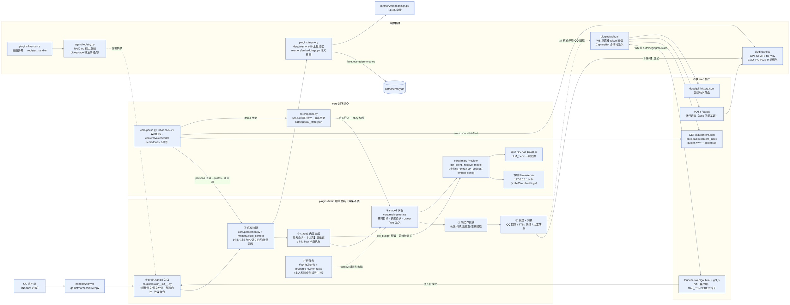

# 架构图：Agent 主链与能力面（2026-09-11 · 通用化后新版 · mermaid）

> 替代口径：归档旧图 `docs/archive/agent结构图-2026-09-09.png`（顺序主链六站 + harness 层 + 三后台循环 + 数据层）。
> 新版变化：core 收敛出 **llm Provider 适配层 / packs 内容包 / special / reply / atomics / paths**；
> 出口扩为 **QQ + GAL web 双通道**；能力注册统一 **agent/registry ToolCard**。
> 配套：`docs/项目拆解.md`（模块职责）、`docs/架构图-活人感-2026-09-11.md`（活人感链路）。

PNG 渲染版：`架构图-Agent-2026-09-11.png`（重渲：提取本文件 mermaid 代码块为 .mmd 后执行 `npx @mermaid-js/mermaid-cli@11 -i <导出.mmd> -o 架构图-Agent-2026-09-11.png -b white -w 3000`；init 指令已内嵌）

## 读图要点

1. **顺序主链六站**与旧图同构（入口→感知→stage1→stage2→兜底→发送消费），新增并行任务泳道：
   约定自决与 `preparse_owner_facts` 与 stage1 同时 `create_task`，stage2 组装时收取。
2. **所有 LLM 调用走 `core/llm.py`**：`get_client(purpose)` 单例、`resolve_model(purpose)` 专用模型键、
   `thinking_extra` 思维链参数（仅本地 provider 注入）、`ctx_budget` 上下文预算；
   本地引擎默认，`LLM_*` env 切外部端点、代码零改动。
3. **packs 是内容面单入口**：persona 回落（包卡）、`/gal/content.json` 台词与差分映射、
   voice 合并、道具目录，全部"无包=原行为"。
4. **registry（ToolCard）是代码级扩展唯一正路**（铁律 1）：livesource 弹幕钩子经它注册，
   pack type=tool 装载后同样落到 ToolCard 契约。
5. **双出口**：QQ 通道与 GAL web 通道互斥（webgal gal 门停用 QQ 通道）；GAL 页文字逐行
   `POST /gal/tts` 取语音，sprite 帧切差分，回想轮次落 `data/gal_history.jsonl`。
