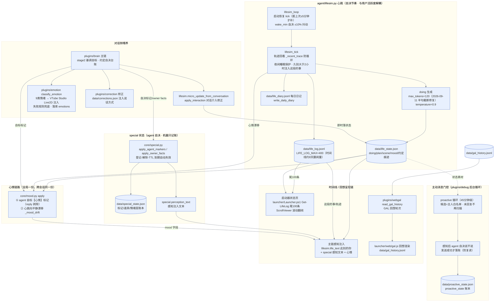

# 架构图：活人感链路（2026-09-11 · 通用化后新版 · mermaid）

> 对齐口径：归档旧图 `docs/archive/活人感拆解图-2026-09-09.png`（主链六站活人感能力 + 后台循环喂养 +
> 记忆沉淀 + 自决判定）。
> 新版聚焦"活人感"的**状态生产-消费闭环**：lifesim 心跳 → 心情/special 状态 → 主链感知注入 →
> 呈现面（状态页时间线 / GAL 回想）。
> 配套：`docs/架构图-Agent-2026-09-11.md`（主链全貌）、`docs/项目拆解.md` §四。

PNG 渲染版：`架构图-活人感-2026-09-11.png`（重渲：提取本文件 mermaid 代码块为 .mmd 后执行 `npx @mermaid-js/mermaid-cli@11 -i <导出.mmd> -o 架构图-活人感-2026-09-11.png -b white -w 3000`；init 指令已内嵌）

## 读图要点

1. **心跳是活人感的"生活"来源**：与用户活跃度解耦（用户不在线也照常转）；doing 生成
   `max_tokens=120`（长度感归提示层与前端句读截断），状态进 `life_state.json`、事件进
   `life_log.jsonl`（上限 400 条，配合状态页 ScrollViewer 滚动翻阅约 8 天）。
2. **心情链路两通道**：agent 自标【心情】（零额外调用，`core/reply` 剥除标记）+ 心跳"向平静漂移"
   自然衰减；存 `life_state.json`，经 `life_text` 注入"此刻的你"。
3. **special 状态 = agent 自决标记**（登记/解除/TTL 到期失效），机器只存事实不代写演出；
   道具目录来自内容包（type=item）+ 开放集登记。
4. **主动消息全链自决**：找不找 TA / 什么时候找 / 说什么全 agent 决定；门控硬纪律只有
   "候选白名单 + 未回复不再扫描 + 发送成功才落账"。
5. **呈现闭环**：状态页时间线（尾 100 条滚动翻阅）与 GAL 回想（`gal_history.jsonl`）消费同一份
   生活状态；久别重逢时 `life_log` 作为「这段时间的事」回注主链——沉淀即闭环。
